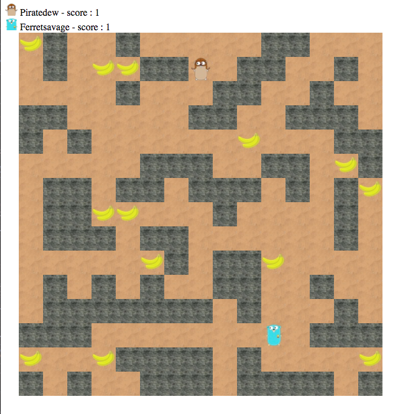

## MKTD Island Go client player

MKTD Island is a practical work originally proposed at the [MKTD5 event](https://www.meetup.com/fr-FR/Monkey-Tech-Days/events/237545492/).

This client code connects to a server instance called the mediator.
It implements an algorithm that controls a character on a map filled with bananas and uncrossable walls.
Two players face, one instance of the client code controls one player.
The players want to catch the bananas on the map.
The game stops when there are no bananas left, the player that caught the more bananas wins the game.

### How it works

The mediator and the two client instances act like small HTTP servers.
They must be able to reach each other for the game to start.
The easiest way to do that is to ensure that they are started on the same local network.

When the mediator starts, it waits for two clients to have registered to start the game.
Once they have, the mediator starts acting like a tick that alternatively send a request to each client (providing up-to-date information about the game context) in order to know the next move they want to take.

Here is what a map looks like:



### What do I need to get started?

Of course, as you will be writing go code, you need an up-to-date go SDK installed and properly configured on your machine.
Here is [a doc](https://docs.google.com/document/d/1QfY-sAe2tsldDY679PBk_8pxVuMqwpX4eeP_YyjNGsY/pub) to set it up if we don't have it already.

Once this is done, the next thing you want to do is to download the code to your computer. You want to make sure that the code is downloaded in a specific directory of your `GOPATH`.
Here is the command for Mac/Linux:

```
git clone https://github.com/aubm/mktd-island-go-client.git $GOPATH/src/mktd5/mktd-island/client
```

And Windows:

```
git clone https://github.com/aubm/mktd-island-go-client.git %GOPATH%\src\mktd5\mktd-island\client
```

Then download the dependencies by going into the project directory and running:

```
go get -u -v ./...
```

This repository contains existing code. You can look at the detail of it if you want but you don't have to.
What we want you to do is to focus on implementing the algorithm that will answer the question "what will be the next move?" each time the mediator asks.
One thing: it better be fast and smart otherwise your character won't eat much bananas.

For this reason, we already implemented all the boring interfacing stuff between the client and the mediator so that you don't have to dig into the detail of how their respective HTTP APIs work. Simple isn't it?

So basically you need to know two things:

- where to put your code.
- how to build and run the client.

#### Where to put your code

The project is composed by multiple packages and sub packages.
As said before, you don't need to walk through all of them. In fact you can directly open the `client/game/strategy/default.go` file.

The file contains very little code, your entry point is the `DecideWhereToGo` method. This particular function is the one you have to complete in order to answer the mediator question.
It has a bit of documentation on it so that you know what values the function is expected to return, we suggest you to read it.
As you can see, this minimal implementation always return the values `mediator.None` and a nil error. This means that your character will never take a move, and he is ok with it. This is obviously not acceptable!

We also strongly recommend that you use an editor that provides good code completion as this will be very helpful.

#### How to build and run the client

In order to build and run the client, you need a running mediator.
Once you have it and you know its address, open a terminal in the folder `$GOPATH/src/mktd5/mktd-island/mktd-player` (Mac/Linux) or `%GOPATH%\src\mktd5\mktd-island\mktd-player` (Windows) and run:

```
go run main.go -m http://<mediator-ip>:<mediator-port> -t "My team name"
```

The default value for the `-m` flag is `http://localhost:8080` so if you have a running mediator that you can reach using this value, you can just run:

```
go run main.go -t "My team name"
```

If the mediator is unreachable, the program will print out this error:

```
FATA[0000] failed to register to the mediator: failed to perform json request: failed to execute http request, method = POST, url = /player: failed to perform http request: Post http://localhost:8089/player: dial tcp [::1]:8089: getsockopt: connection refused
```

If everything is ok, the program will have this output:

```
INFO[0000] starting game
INFO[0000] found my local ip                             ip=192.168.1.69
INFO[0000] about to register to the mediator             endpoint="192.168.1.69:50407" team=My team name
INFO[0000] starting player web server                    port=50407
```

If the game is full (e.g: already has two players registered), it will print a warning:

```
WARN[0000] could not register to the mediator, the game is full
```

Located your program endpoint in the program startup, next to `about to register to the mediator` line?

```
INFO[0000] about to register to the mediator             endpoint="192.168.1.69:50407" team=My team name
```

Take this endpoint and put it in your web browser to watch the game!

##### Additional tips

###### Log stuff

Maybe you already noted that `DefaultMoveStrategy` has a `Logger` field.
You can use the logger in the methods by calling `d.Logger.Info(...)`.

The logger has different types of logs (`Info`, `Warn`, `Error`, `Fatal`, `Debug`).
Maybe don't use `Fatal` because it will cause your program to stop with an ugly error stacktrace.
Better use `Error` or `Warn` to print some context about an unexpected behavior in your code.

Use `Info` as much as you like, that being said, `Debug` is also a clever choice because the stuff you log using this method will only be printed out
if you provide the `-v` flag. Example:

```
go run main.go -t "My team name" -v
```

###### Client port

When the program starts, it will try to automatically find a free port to start the client web HTTP server.
If you need to, you can force the program to use a specific port by providing the `-p` flag. Example:


```
go run main.go -t "My team name" -p 9001
```

###### Team name

As for the port, the team name is generated randomly if you don't provide it.
If you ever feel to tired of typing your team name, just let the random magic happen.

### Any advice before you leave me alone in the jungle?

Yes.

Be creative! Of course you can implement a nice path finding algorithm, and if you never have, you should try, it is actually pretty fun ([here is a Youtube video](https://www.youtube.com/watch?v=KNXfSOx4eEE) to help you getting started with it).

But you really don't have to, this work is more about having fun with writing go code than implementing a specific algorithm, so feel free to get wild.
You could for example:

- start easy with a dumb random algorithm, you would be surprised of how you can become attached to your little guy, even though it can be frustrating to see him turning around a banana, and never catch it! You might even start believing he is doing it on purpose only to drive you mad!
- "brute force" the map by making sure you have been on each and everyone of the walkable cells. Chances of victory are quite low but you never know!
- cheat a little bit by controlling your character with a specific hashtag on Twitter. Go happens to have a [nice client hosted on Github for using the Twitter APIs](https://github.com/ChimeraCoder/anaconda).

Happy coding!


